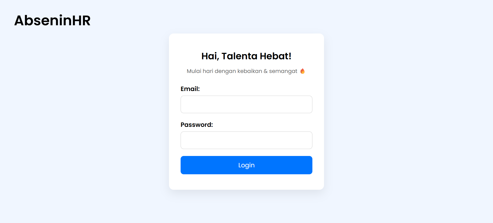
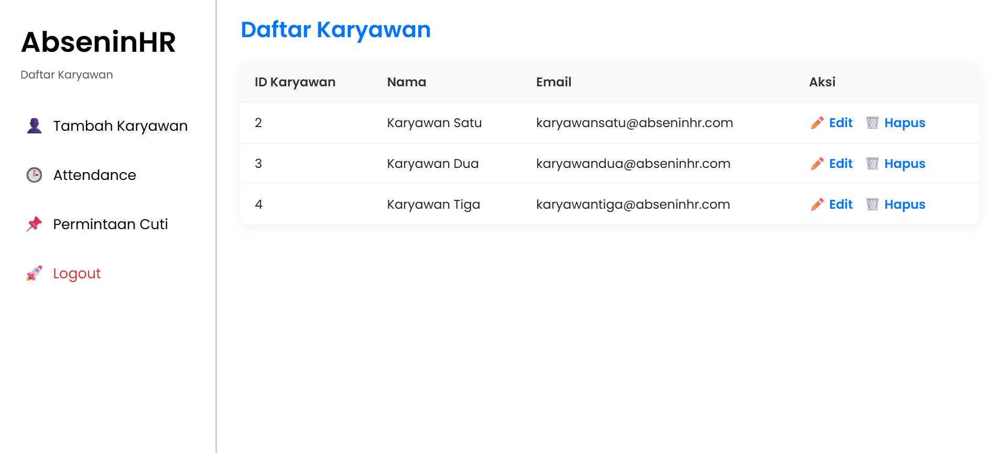
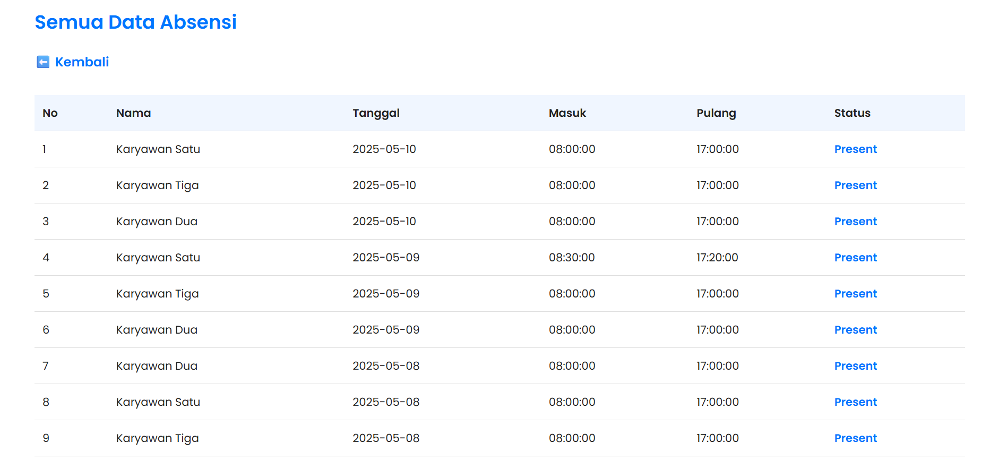
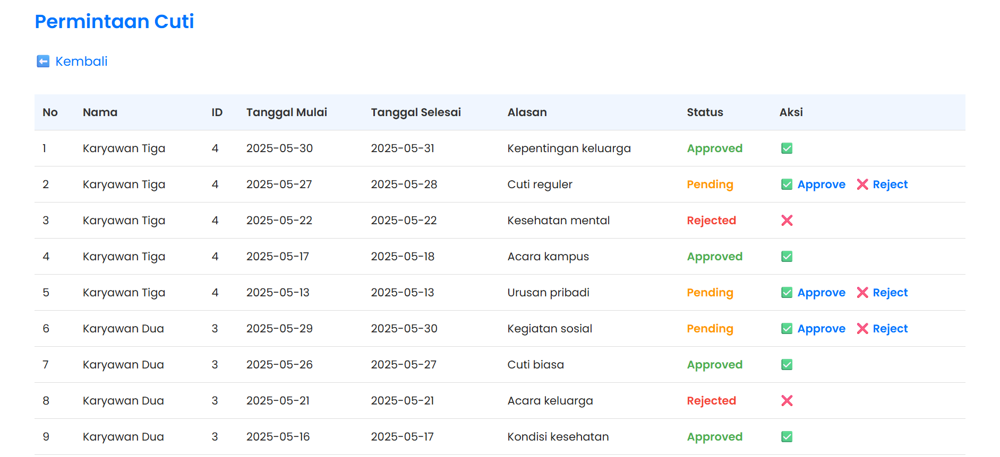
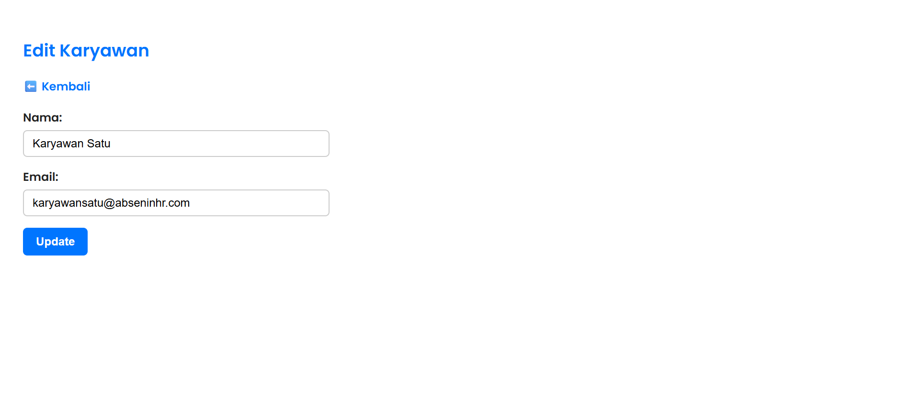
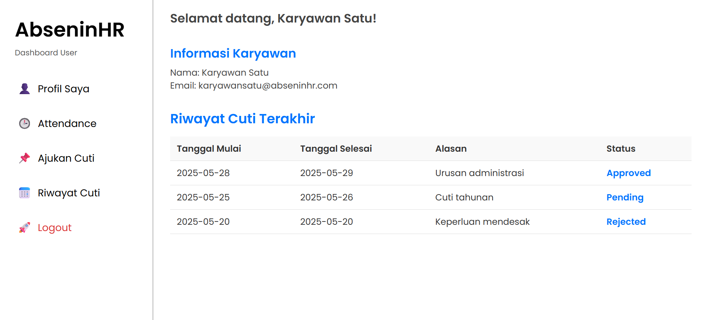
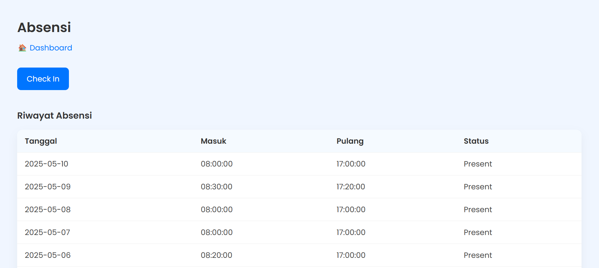
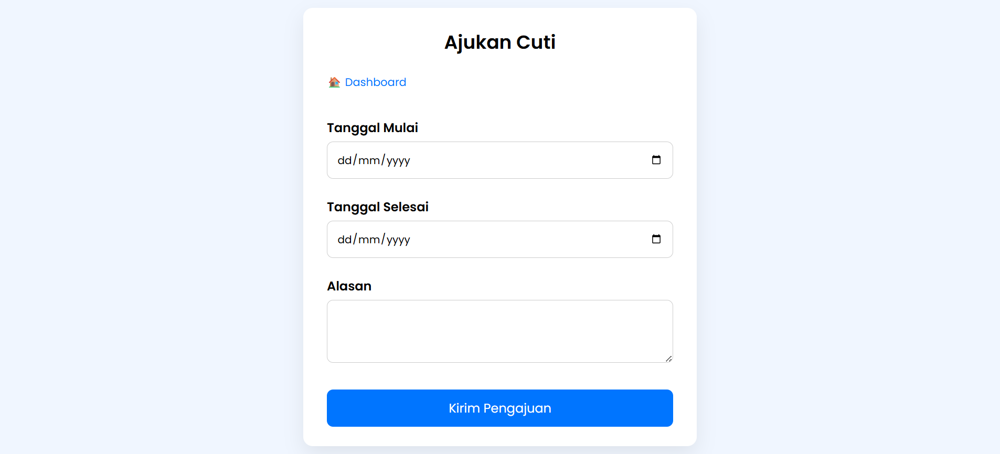
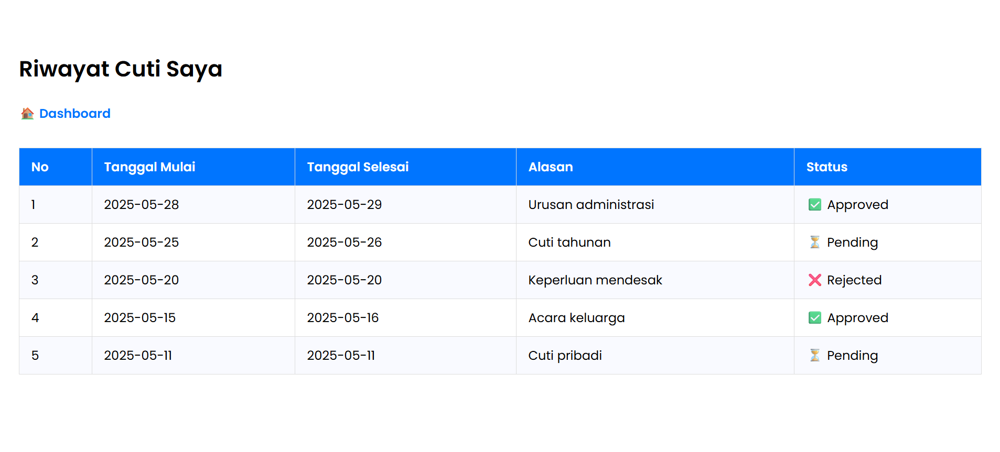

# AbseninHR

**AbseninHR** is a simple Human Resource (HR) web application that allows companies to manage employee attendance and leave requests.

⚠️ **For educational purposes only.**

This project is intended **for learning and educational purposes only**. It is not intended for production use and may be useful for those exploring web application security or penetration testing techniques.

## 🚀 Features

### Admin (HR)

- ➕ Add Employee

- ✅ Approve / ❌ Reject Leave Requests

- 🗑️ Delete Employee

- ✏️ Edit Employee Information

- 📊 View Attendance Records

- 📋 View Employee List

- 📮 View Leave Applications

- 🔐 Login & Logout

### User (Employee)

- 📝 Submit Leave Request

- ⏱️ Check In / Check Out

- 🧭 Dashboard Overview

- ✏️ Edit Profile

- 📅 View Leave History

- 📄 View Profile

- 🔐 Login & Logout

## 🖼️ Preview

### Login



### Admin (HR)










### User (Employee)










## 🛠️ Requirements

To run this project locally, make sure you have the following installed:

- [XAMPP](https://www.apachefriends.org/) (Apache, MySQL, PHP)

- Web browser (e.g., Chrome, Firefox)

- Git (optional, for cloning)

- Code editor (e.g., VS Code, optional)


## ⚙️ Installation

To run this project locally:

1. Clone the repository:

   ```bash
   git clone https://github.com/narendrabrilians/abseninhr.git
   ```

2. Move the folder to your XAMPP `htdocs` directory:

   ```
   C:\xampp\htdocs\abseninhr
   ```

3. Launch **Apache** and **MySQL** using XAMPP Control Panel.

4. Create a new database named `abseninhr`, then run the SQL statements from `sql/initial.sql` to initialize it.

5. Edit `config/db.php` to match your local MySQL credentials

6. Open your browser and go to:

   ```
   http://localhost/abseninhr
   ```

## 🌱 Thank You

Thanks for visiting this project!  
Hope it helps you in learning, testing, or building something better.